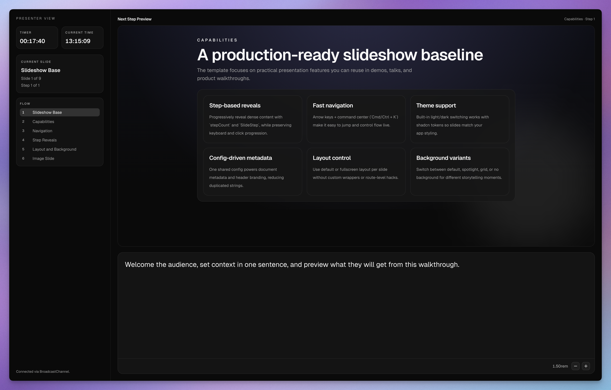

# Slideshow Base (Next.js)

Reusable slideshow template built with Next.js, React, Tailwind, and shadcn/ui.

## Screenshots

### Landing page


### Presenter view



## What this template includes

- Route-per-slide presentation flow (`/slides/[slug]`)
- Keyboard navigation (`Arrow`, `PageUp/PageDown`, `Space`)
- Step reveals with `stepCount` + `SlideStep`
- Click-to-advance reveal area for stepped slides
- Command center (`Cmd/Ctrl + K`) for quick jump
- Presenter popout window with `BroadcastChannel` sync
- Presenter notes per slide via `notes` in `app/slides.tsx`
- Presenter timer + 24h current-time clock
- Presenter next-step preview (aware of reveal steps)
- Presenter flow window (previous 2 + current + next 5 slide titles)
- Presenter notes font-size controls
- Light/dark theme toggle
- Slide-level layout/background/header controls
- Typed image slide support
- PDF export pipeline for static handout rendering

## Quick start

```bash
pnpm install
pnpm dev
```

Open [http://localhost:3000](http://localhost:3000).

## Project structure

- `app/slides.tsx`: slide definitions only
- `types/slides.ts`: slide model/types
- `app/slideshow-config.ts`: global slideshow config (title, description, header defaults)
- `app/slides/blocks/*`: deck-authoring building blocks (layout, typography, collections, media)
- `components/slideshow/slide-shell.tsx`: slideshow chrome (header, navigation, frame)
- `components/slideshow/slide-background.tsx`: shared background variants

## Slide model

`SlideDefinition` supports:

- Core: `slug`, `title`, `body`
- Optional flow: `stepCount`, `notes`
- Optional chrome/layout: `header`, `footer`, `layout`, `background`

Slide primitives can read the current slide `title` from context, so template
blocks only need an explicit `title` prop when you want to override the slide
title text inside the layout.

### Header behavior

`header` can be:

- `"visible"`: always render header
- `"hidden"`: never render header
- `"auto"`: render in default layout, hide in fullscreen layout

Global default is configured in `app/slideshow-config.ts`.

### Footer behavior

`footer` can be:

- `"visible"`: full previous/next controls + counter
- `"counter"`: counter only (`Slide x of y`)
- `"hidden"`: no footer

## Adding slides

Add entries to `app/slides.tsx`.

Example content slide:

```tsx
{
  slug: "my-slide",
  title: "My Slide",
  body: <MySlideComponent />,
  background: "spotlight",
}
```

Presenter notes example:

```tsx
{
  slug: "my-slide",
  title: "My Slide",
  notes: "Speaker-only context and reminders shown in /presenter.",
  body: <MySlideComponent />,
}
```

Example image slide:

```tsx
{
  slug: "diagram",
  title: "Architecture Diagram",
  body: (
    <ImageShowcaseSlide
      image={{ src: diagramImage, alt: "System architecture", placeholder: "blur" }}
    />
  ),
  layout: "fullscreen",
  header: "hidden",
}
```

Example fullscreen video slide with autoplay:

```tsx
{
  slug: "launch-video",
  title: "Launch Video",
  body: (
    <FullscreenMediaSlide
      media={{ kind: "video", src: "/videos/launch.mp4", autoplay: true }}
    />
  ),
  layout: "fullscreen",
  header: "hidden",
  footer: "hidden",
}
```

`FullscreenMediaSlide` options:

- `variant: "framed" | "background"` (`background` is edge-to-edge)
- `overlay: "none" | "subtle" | "medium" | "strong"` for text readability over media
- `media.fit: "cover" | "contain"` (defaults to `"cover"`)

## Presenter preview context

Presenter previews render slide routes with `?presenterPreview=1`, and slides
can detect that mode with `useIsPresenterPreview()` from
`components/slideshow/slide-context.tsx`.

Use that hook in custom client components to skip autoplay, audio, canvas, or
other expensive interactive rendering inside the presenter preview iframe.

The built-in video slide primitives already suppress autoplay in presenter
preview, and image `alt` text now falls back to `""` when omitted.

## Background variants

`background` supports:

- `"default"`
- `"spotlight"`
- `"grid"`
- `"none"`

Add custom variants in `components/slideshow/slide-background.tsx`.

## PDF export

Use Playwright + PDF-lib export:

```bash
pnpm exec playwright install chromium
pnpm export:pdf
```

Dark export theme:

```bash
pnpm export:pdf -- --dark
```

This runs a production build in `NEXT_PUBLIC_PDF_EXPORT=1` mode and writes:

- `out/slides.pdf`

Slide routes are discovered from `app/sitemap.ts` (`/sitemap.xml`) so export
stays aligned with your actual published slideshow paths.

Export mode behavior:

- fixed viewport (default `1920x1080`)
- animations/transitions disabled
- slideshow header/footer hidden

Optional env vars:

- `PDF_EXPORT_WIDTH` (default `1920`)
- `PDF_EXPORT_HEIGHT` (default `1080`)
- `PDF_EXPORT_PORT` (default `3410`)
- `PDF_EXPORT_OUTPUT` (default `out/slides.pdf`)

Skip build (reuse existing `.next` build):

```bash
pnpm export:pdf -- --skip-build
```
